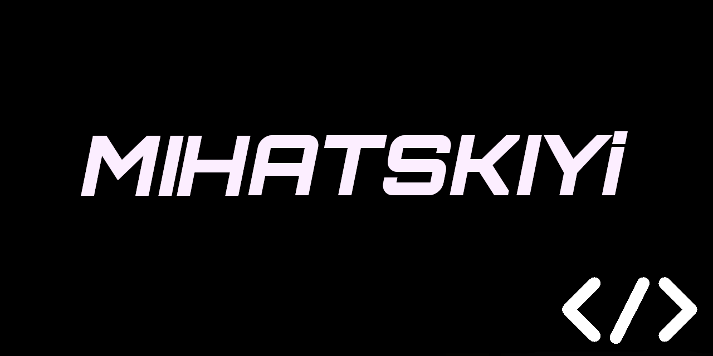

<!-- Banner -->

  

<h1 align="center">Hi, I'm MiHaTsKiYi 👋</h1>

  💻 Passionate developer | 🚀 Optimization Enthusiast | 🎨 UI/UX Explorer

---

## 🔥 About Me  
👨‍💻 I'm a developer passionate about **PC optimization**, **scripting**, and **performance tuning**.  
💡 I love working with **Python, HTML, CSS, JavaScript**, and exploring **VCS, ZSH, and Hyprland**.  
🎯 My goal is to create **high-performance tools** that optimize system usage and enhance workflow efficiency.  

---

## 🚀 Current Projects  
🔹 **[TaskMGR](https://github.com/MiHaTsKiYi13/TaskMGR)** — Advanced task manager to control and optimize system processes.  
🔹 **[de3nake.mihatskiyi13](https://github.com/MiHaTsKiYi13/de3nake.mihatskiyi13)** — A powerful PC optimization tool with deep system tweaks.  

🌟 I’m always improving and adding new features to these projects! Feel free to **contribute** or **suggest** new ideas.  

---

## 🛠️ Tech Stack & Tools  
💻 **Languages**:  

🛠 **Tools & Environment**:  

---

## 🌍 Let's Connect  
📢 **Telegram**: [@mihatskiyi](https://t.me/mihatskiyi)  
📂 **GitHub**: [MiHaTsKiYi13](https://github.com/MiHaTsKiYi13)  

💡 If you have ideas, suggestions, or just want to chat, feel free to reach out! 🚀  

---

### ⭐ Fun Fact  
🔹 **"Optimization is not just a process, it’s an art!"**  
🚀 Let’s build something amazing together! 🎯  
